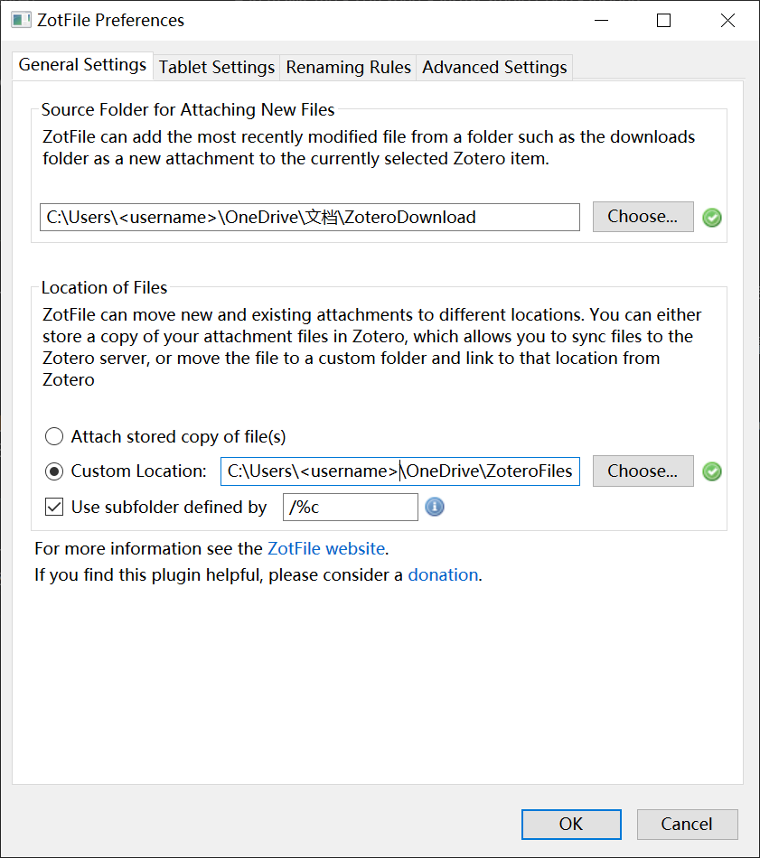
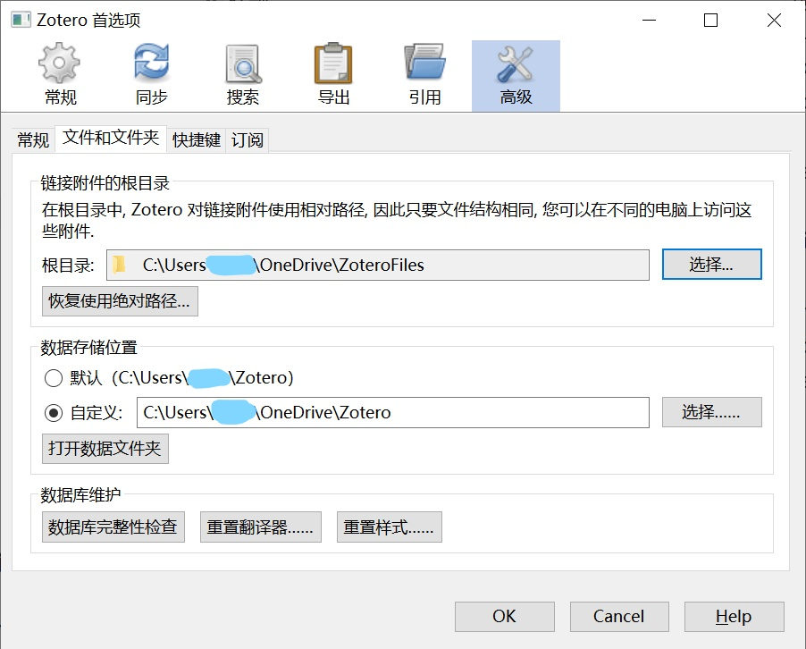
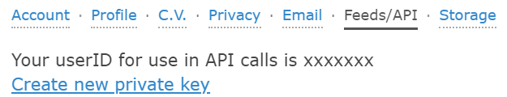

# ZotExpert - 用 PDF Expert 打开 Zotero 文献

**更新说明**：不需要付费软件 JSBox 啦！只需要 iOS 自带的「快捷指令」即可！

## 引言

Zotero 是一款免费开源的文献管理软件，但是目前现行的跨平台同步方式都各有缺点，无法满足个人的使用需要：

WebDAV 同步

1. 文件储存**位置杂乱无序**，同一主题的文献 PDF 无法在文件层面集中在一起，给批量管理带来困难；
2. iOS/iPadOS 平台上的 PaperShip 年久失修，目前还有一些 PDF 不能打开（报404），即使能打开的也只能在应用内标注，在 PDF Expert 等外部应用标注的结果**无法同步**。

Zotero 同步

1. 除了用的是 Zotero 官方存储空间（有些**贵**）以外，缺点与第1条一样。

Zotfile 外部存储同步

1. 用 Zotfile 插件将 PDF 移到外部文件夹，然后再用 OneDrive 等工具同步，每个分类都在同一个子文件夹中，利于文献归类；
2. 但是，iOS/iPadOS 平台上 PDF **不能直接打开**，需要手动去 PDF Expert 找寻文件位置。

基于以上几点，我写了这个 iOS/iPadOS 自带的「快捷指令」，能够在 Safari 打开 Zotero 网页版时，用 PDF Expert 打开相应的 PDF，而且所作标注可以跨平台同步；实际的操作效果如下：

## 前提配置

### Zotero 电脑端配置

1. 有 Zotero 账号，在 Zotero 客户端登入（先不要打开附件同步功能）；
2. 安装 Zotfile 插件，并将附件设置到 OneDrive 等云同步文件夹下；
    
3. 回到 Zotero 的设置，将附件存储到**相对路径**；
    
4. 重新打开 Zotero 的同步功能（如果你想同步除 PDF 之外的其他资源的话）。

### Zotero 网页端配置

1. 网页端登入 Zotero 账号，进入 Settings 的 Feeds/API 模块；
2. 记下图中显示在「xxxxxxx」位置的数字，即**用户 ID**（`userid`）；
    
3. 点击 Create new private key，一路下一步就行（notes access 也可以开），生成 Key 之后**不要离开页面**，先复制下来，作为 **API Key**（`APIKey`）。

### PDF Expert 配置

1. 在左下角「连接」处添加连接，并绑定你所使用的云盘（如OneDrive）；
2. 选择附件文件夹（例子中是 ZoteroFiles），点击右下角的「…」，并选择「同步」；
3. 打开「我的文件」中的「已同步文件夹」，这时应该可以看到刚才选的文件夹已经开始同步了，耐心等待其同步完成即可。
4. 这里需要记住你刚才设定的**附件文件夹的名字**，即**同步文件夹名称**（`syncedFolder`）。

# 脚本安装

## 快捷指令

1. 将 iOS 升级到 13 或以上；
2. 通过 [这个链接](https://www.icloud.com/shortcuts/2bc50081d84745719faa1fda14bcebe7) 安装快捷指令，并打开「共享表单」功能、允许访问互联网。
3. 在弹出的问题中，根据之前记下的内容，填写「用户 ID」、「API Key」和「同步文件夹名称」三个问题。

## Safari

1. 打开任意网页，点击右上角分享按钮，滑到最下方「编辑操作」；
2. 把「ZotExpert」放到你喜欢的位置。

# 使用

1. 用 Safari 打开 Zotero 官网的 My Library，并**切换到新版界面**（右上角 Try the New Web Library Beta）。
2. 点开任意一篇论文的 Attachments ，分享到 ZotExpert。
3. Enjoy!!

# 其他

欢迎 Star, Fork, Issue, PR~
